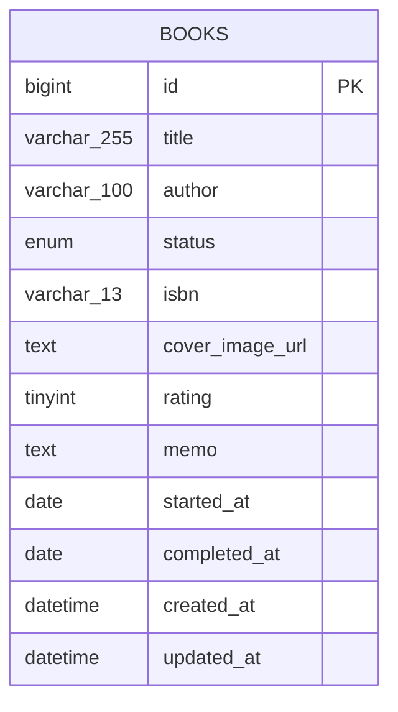
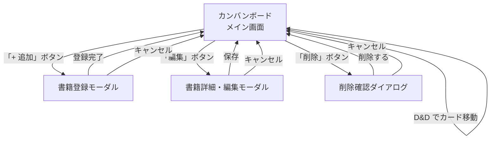
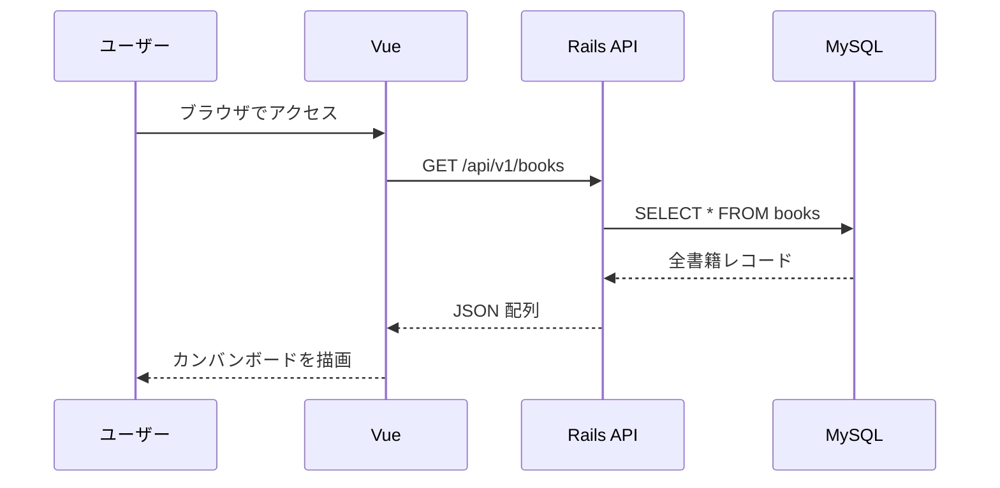
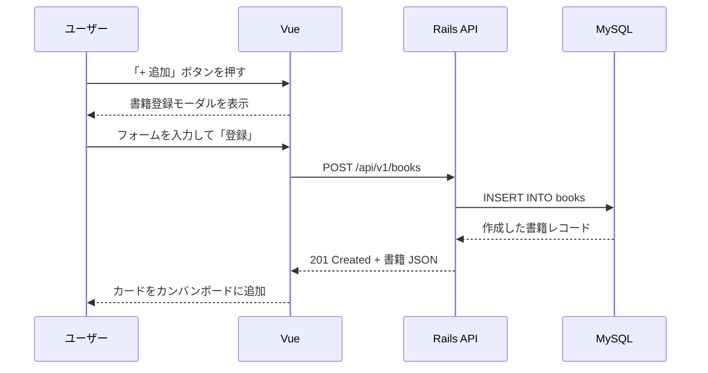
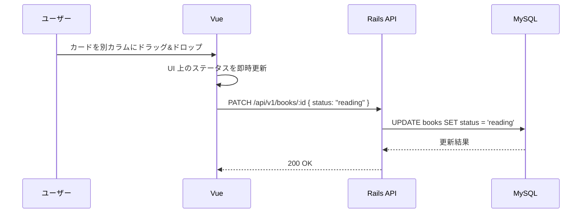
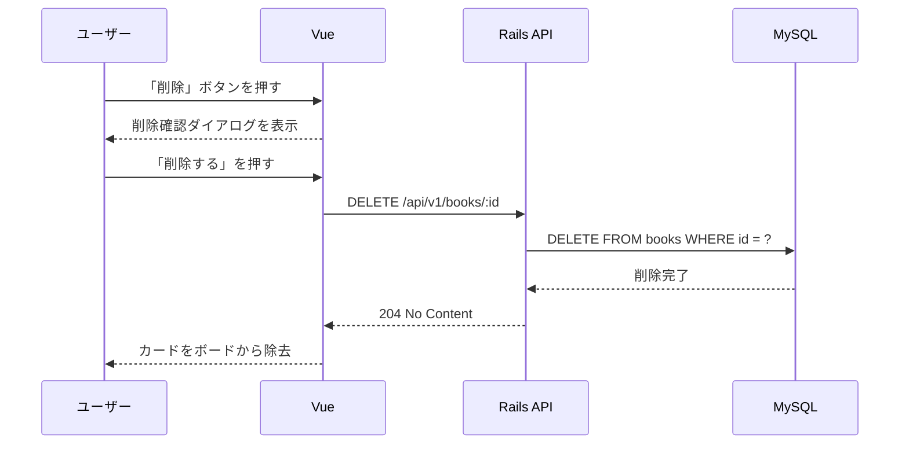

# 詳細設計

## 技術スタック

| レイヤー | 技術 | バージョン |
|---|---|---|
| フロントエンド | Vue 3 + TypeScript (Vite) | Vue 3.x / Vite 5.x |
| バックエンド | Ruby on Rails (API mode) | Rails 7.x / Ruby 3.3 |
| データベース | MySQL | 8.0 |
| インフラ（本番） | AWS EC2 + RDS | t3.micro / db.t3.micro |
| 開発環境 | Docker Compose | - |

---

## ER 図



> 現時点では books テーブル1つのみ。将来的にユーザー管理や複数テーブルを追加する場合はここにリレーションを追記する。

---

## テーブル定義

### books テーブル

| カラム | 型 | 制約 | 説明 |
|---|---|---|---|
| id | bigint | PK, AUTO_INCREMENT | 書籍 ID |
| title | varchar(255) | NOT NULL | タイトル |
| author | varchar(100) | NOT NULL | 著者名 |
| status | enum | NOT NULL, DEFAULT 'unread' | 読書ステータス |
| isbn | varchar(13) | NULLABLE | ISBN（13桁） |
| cover_image_url | text | NULLABLE | 表紙画像の外部 URL |
| rating | tinyint | NULLABLE | 評価（1〜5）|
| memo | text | NULLABLE | 感想メモ |
| started_at | date | NULLABLE | 読み始め日 |
| completed_at | date | NULLABLE | 読了日 |
| created_at | datetime | NOT NULL | 登録日時 |
| updated_at | datetime | NOT NULL | 更新日時 |

status の enum 値: `unread`（未読） / `reading`（読書中） / `completed`（読了）

---

## API 設計

Base URL: `/api/v1`

### エンドポイント一覧

| Method | Path | 用途 | ステータスコード |
|---|---|---|---|
| GET | /books | 書籍一覧取得・フィルタリング | 200 |
| POST | /books | 書籍新規登録 | 201 / 422 |
| GET | /books/:id | 書籍詳細取得（画面表示） | 200 / 404 |
| PATCH | /books/:id | 書籍情報の編集 | 200 / 404 / 422 |
| PATCH | /books/:id | カンバンボードの移動（status のみ更新） | 200 / 404 |
| DELETE | /books/:id | 書籍削除 | 204 / 404 |

> PATCH は「書籍情報の編集」と「カンバン移動」の両方で使用する。送信するフィールドが異なるだけで、エンドポイントは同一（`/books/:id`）。

### HTTPメソッドと用途の対応

| 操作 | Method | 理由 |
|---|---|---|
| 画面表示（一覧・詳細） | GET | データ取得のみ。副作用なし |
| フィルタリング・検索 | GET | 条件はクエリパラメータで渡す。副作用なし |
| 書籍登録 | POST | 新しいリソースを作成する |
| 書籍情報の編集 | PATCH | リソースの一部フィールドを更新する |
| カンバンボードの移動 | PATCH | status フィールドのみを部分更新する |
| 書籍削除 | DELETE | リソースを削除する |

### クエリパラメータ（GET /books）

| パラメータ | 型 | 説明 | 例 |
|---|---|---|---|
| status | string | ステータスでフィルタ | `?status=reading` |
| q | string | タイトル・著者の部分一致検索 | `?q=リーダブル` |

### リクエスト・レスポンス例

**GET /books?status=reading**

```json
// Response 200
[
  {
    "id": 2,
    "title": "Clean Architecture",
    "author": "Robert C. Martin",
    "status": "reading",
    "isbn": null,
    "cover_image_url": null,
    "rating": null,
    "memo": null,
    "started_at": "2026-05-01",
    "completed_at": null,
    "created_at": "2026-05-25T00:00:00.000Z"
  }
]
```

**POST /books（書籍登録）**

```json
// Request Body
{
  "title": "リーダブルコード",
  "author": "Dustin Boswell",
  "status": "unread",
  "isbn": "9784873115658"
}

// Response 201
{
  "id": 1,
  "title": "リーダブルコード",
  "author": "Dustin Boswell",
  "status": "unread",
  "isbn": "9784873115658",
  "cover_image_url": null,
  "rating": null,
  "memo": null,
  "started_at": null,
  "completed_at": null,
  "created_at": "2026-05-25T00:00:00.000Z"
}
```

**PATCH /books/:id（書籍情報の編集）**

```json
// Request Body
{
  "title": "リーダブルコード 改訂版",
  "rating": 5,
  "memo": "とても読みやすかった"
}

// Response 200
{ "id": 1, "title": "リーダブルコード 改訂版", "rating": 5, "memo": "とても読みやすかった", ... }
```

**PATCH /books/:id（カンバンボードの移動）**

```json
// Request Body — status フィールドのみ送信
{ "status": "reading" }

// Response 200
{ "id": 1, "status": "reading", ... }
```

**DELETE /books/:id（書籍削除）**

```
// Response 204 No Content（ボディなし）
```

---

## 画面一覧

| 画面名 | 種別 | 説明 |
|---|---|---|
| カンバンボード | ページ（メイン） | 3カラムのボード。全書籍カードを表示し、D&D でステータスを変更する |
| 書籍登録モーダル | モーダル | 新規書籍を登録するフォーム |
| 書籍詳細・編集モーダル | モーダル | 既存書籍の詳細確認および全フィールドの編集フォーム |
| 削除確認ダイアログ | ダイアログ | 削除前の確認メッセージと「削除する」「キャンセル」ボタン |

---

## 画面遷移図



---

## データフロー

### 初期表示



### 書籍登録



### D&D によるステータス変更



### 書籍削除



---

## ディレクトリ構成

```
LibraryManagement/
├── frontend/                   # Vue 3 + TypeScript
│   ├── src/
│   │   ├── components/
│   │   │   ├── KanbanBoard.vue
│   │   │   ├── KanbanColumn.vue
│   │   │   ├── BookCard.vue
│   │   │   └── BookModal.vue
│   │   ├── api/
│   │   │   └── books.ts        # API 呼び出し関数
│   │   ├── types/
│   │   │   └── book.ts         # Book 型定義
│   │   └── App.vue
│   ├── Dockerfile
│   └── package.json
├── backend/                    # Ruby on Rails API
│   ├── app/
│   │   ├── controllers/api/v1/books_controller.rb
│   │   ├── models/book.rb
│   │   └── serializers/book_serializer.rb
│   ├── config/routes.rb
│   ├── db/migrate/
│   ├── Dockerfile
│   └── Gemfile
├── docs/
│   ├── requirements.md         # 要件定義
│   └── detailed-design.md      # 本ドキュメント
├── docker-compose.yml
├── CLAUDE.md
└── README.md
```

---

## デプロイ構成図


- EC2 セキュリティグループ: 80（HTTP）・22（SSH）を開放
- RDS セキュリティグループ: EC2 からの 3306 のみ許可
- 環境変数: EC2 の `.env` で DB 接続情報を管理（git 管理外）

---

## Docker 構成（開発環境）

```yaml
# docker-compose.yml（概要）
services:
  frontend:   # Vue 3 + Vite → localhost:5173
  backend:    # Rails API    → localhost:3000
  db:         # MySQL 8.0    → localhost:3306（db_data ボリュームで永続化）
```

- フロントエンドはローカルの Node.js（v24）で直接起動も可能
- Ruby / Rails はローカルインストール不要（Docker コンテナ内で動作）
- `docker compose down` でコンテナ停止、`-v` オプションで DB データも削除

---

## 実装フェーズ詳細

責務分離の観点から **Read → Create → Update → Delete** の順で実装する。
フロントエンド（Phase 1〜4）をモックデータで完成させてから、バックエンド（Phase 5〜8）を構築し、最後に接続・統合・デプロイを行う。

```
[フロントエンド層]          [バックエンド層]        [統合・インフラ]
Phase 1: Read (表示)
Phase 2: Create (登録)
Phase 3: Update (変更)  →  Phase 5: Read API
Phase 4: Delete (削除)     Phase 6: Create API  →  Phase 9: API 接続
                           Phase 7: Update API      Phase 10: Docker 統合
                           Phase 8: Delete API      Phase 11: AWS デプロイ
```

---

### Phase 1 — [Read] Vue プロジェクト作成・カンバンボード表示

**目標:** モックデータを3カラムに正しく振り分けて表示する。

#### 実行コマンド

```bash
npm create vite@latest frontend -- --template vue-ts
cd frontend
npm install
npm install axios vue-draggable-plus
```

#### 作成・編集するファイル

| ファイル | 内容 |
|---|---|
| `src/types/book.ts` | Book 型定義（id, title, author, status, rating, memo など） |
| `src/components/KanbanBoard.vue` | 3カラムを横並びで表示・モックデータを status でフィルタして各カラムへ渡す |
| `src/components/KanbanColumn.vue` | カラムタイトルと BookCard 一覧を表示 |
| `src/components/BookCard.vue` | タイトル・著者を表示するカード（操作ボタンはまだなし） |
| `src/App.vue` | KanbanBoard をマウント |

#### モックデータ仕様

```ts
const books = ref<Book[]>([
  { id: 1, title: 'リーダブルコード', author: 'Dustin Boswell', status: 'unread' },
  { id: 2, title: 'Clean Architecture', author: 'Robert C. Martin', status: 'reading' },
  { id: 3, title: 'ドメイン駆動設計', author: 'Eric Evans', status: 'completed', rating: 5 },
])
```

#### 完了条件

- `npm run dev` で `http://localhost:5173` にアクセスし 3カラムが表示される
- 各書籍が正しいカラムに表示される

---

### Phase 2 — [Create] 書籍登録モーダル

**目標:** 「+ 追加」ボタンからモーダルを開き、書籍をモックデータに追加できる。

#### フォームフィールド方針

登録モーダルは **シンプルな4項目のみ** とする。評価・感想・読み始め日・読了日は「本を読んだ後に記入するもの」であるため、編集モーダル（Phase 3）で入力する設計とする。

| フィールド | 必須 | 備考 |
|---|---|---|
| タイトル | ◎ | |
| 著者 | ◎ | |
| ISBN | - | 任意入力 |
| ステータス | - | デフォルト `unread` |

> rating・memo・started_at・completed_at は Phase 3 の編集モーダルで追加する。

#### 作成・編集するファイル

| ファイル | 内容 |
|---|---|
| `src/components/BookModal.vue` | タイトル・著者・ISBN・ステータスの入力フォーム |
| `src/components/KanbanBoard.vue` | 「+ 追加」ボタンと BookModal の表示制御を追加 |

#### 完了条件

- 「+ 追加」ボタンを押すとモーダルが開く
- フォームを入力して「登録」を押すと、対応するカラムにカードが追加される
- 必須項目（タイトル・著者）が空のまま登録しようとするとエラーを表示する

---

### Phase 3 — [Update] D&D ステータス変更・編集モーダル

**目標:** カードの移動と内容編集をモックデータ上で動作させる。

#### フォームフィールド方針

編集モーダルは登録モーダルの4項目に加え、**読了後に記入する詳細フィールドも含める**。

| フィールド | 必須 | 備考 |
|---|---|---|
| タイトル | ◎ | |
| 著者 | ◎ | |
| ISBN | - | 任意入力 |
| ステータス | - | |
| 評価（rating） | - | 1〜5 の星評価 |
| 感想メモ（memo） | - | テキストエリア |
| 読み始め日（started_at） | - | date 入力 |
| 読了日（completed_at） | - | date 入力 |

> 登録時はシンプルな4項目に絞り、読後に詳細を編集するフローを想定している（Phase 2 の設計方針より）。

#### 作成・編集するファイル

| ファイル | 内容 |
|---|---|
| `src/components/KanbanColumn.vue` | vue-draggable-plus で D&D を実装。ドロップ時に book.status を更新 |
| `src/components/BookCard.vue` | 「編集」ボタンを追加 |
| `src/components/BookModal.vue` | 登録・編集を兼用（props で book を受け取った場合は編集モードで全フィールドを表示） |

#### 完了条件

- カードを別カラムにドラッグ&ドロップするとそのカラムに移動する
- 「編集」ボタンを押すとモーダルが開き、既存データが入力済みの状態で表示される
- 編集モーダルでは rating・memo・started_at・completed_at も入力・保存できる
- 保存するとカードの表示が更新される

---

### Phase 4 — [Delete] 削除ボタン・確認ダイアログ（フールプルーフ設計）

**目標:** 誤操作を防ぐ確認ステップを必ず挟んでから書籍を削除する。

#### フールプルーフ設計

削除は取り消しができない破壊的操作のため、以下の設計を必ず守る。

| 設計ルール | 内容 |
|---|---|
| 確認ダイアログ必須 | 削除ボタンを押しても即削除せず、必ずダイアログを表示する |
| 対象を明示 | ダイアログに「『{タイトル}』を削除しますか？」と書籍名を表示する |
| 不可逆であることを明示 | 「この操作は取り消せません」と明記する |
| デフォルトは安全側 | Enter キー・ダイアログ外クリックは「キャンセル」扱いにする |
| ボタンの視覚的区別 | 「削除する」は赤色、「キャンセル」はグレーで表示する |

#### 作成・編集するファイル

| ファイル | 内容 |
|---|---|
| `src/components/DeleteConfirmDialog.vue` | 確認ダイアログ（書籍名・警告文・削除/キャンセルボタン） |
| `src/components/BookCard.vue` | 「削除」ボタンを追加し DeleteConfirmDialog を呼び出す |
| `src/components/KanbanBoard.vue` | 削除確定時に books 配列からカードを除去する処理を追加 |

#### ダイアログ仕様

```
┌─────────────────────────────────────┐
│  書籍を削除しますか？                │
│                                     │
│  『リーダブルコード』を削除します。  │
│  この操作は取り消せません。          │
│                                     │
│  [キャンセル]        [削除する]      │
│   (グレー・default)   (赤色)         │
└─────────────────────────────────────┘
```

#### 完了条件

- 「削除」ボタンを押すと確認ダイアログが表示される
- ダイアログに書籍タイトルが表示される
- 「キャンセル」を押すと何も起きずダイアログが閉じる
- 「削除する」を押したときのみカードがボードから消える
- ダイアログ外をクリックしてもキャンセル扱いになる

---

### Phase 5 — [Read] Rails プロジェクト作成・一覧・詳細 API

**目標:** Docker 上で Rails が起動し、書籍一覧・詳細を返す API を提供する。

#### 実行コマンド

```bash
docker run --rm -v "$(pwd)/backend:/app" -w /app ruby:3.3 \
  bash -c "gem install rails && rails new . --api --database=mysql --skip-git"
```

#### 作成・編集するファイル

| ファイル | 内容 |
|---|---|
| `config/routes.rb` | `namespace :api do namespace :v1 do resources :books end end` |
| `db/migrate/xxx_create_books.rb` | books テーブル定義（テーブル定義参照） |
| `app/models/book.rb` | enum 定義（status）・バリデーション（title・author 必須） |
| `app/controllers/api/v1/books_controller.rb` | `index` / `show` アクションのみ実装 |
| `config/initializers/cors.rb` | localhost:5173 からの CORS を許可 |
| `Dockerfile` | `ruby:3.3-slim` ベース |

#### 完了条件

- `docker compose up backend db` で起動する
- `curl http://localhost:3000/api/v1/books` が `[]` を返す
- `curl http://localhost:3000/api/v1/books/1` が 404 を返す

---

### Phase 6 — [Create] 書籍登録 API

**目標:** POST リクエストで書籍を登録できる。

#### 作成・編集するファイル

| ファイル | 内容 |
|---|---|
| `app/controllers/api/v1/books_controller.rb` | `create` アクションを追加 |

#### 完了条件

- `curl -X POST` で書籍を登録すると 201 と登録データが返る
- タイトル・著者が空の場合は 422 とエラーメッセージが返る

---

### Phase 7 — [Update] 書籍更新 API

**目標:** PATCH リクエストでステータス変更・書籍情報の更新ができる。

#### 作成・編集するファイル

| ファイル | 内容 |
|---|---|
| `app/controllers/api/v1/books_controller.rb` | `update` アクションを追加 |

#### 完了条件

- `curl -X PATCH` でステータスを変更すると 200 と更新後データが返る
- 存在しない ID を指定すると 404 が返る

---

### Phase 8 — [Delete] 書籍削除 API

**目標:** DELETE リクエストで書籍を物理削除できる。

#### 作成・編集するファイル

| ファイル | 内容 |
|---|---|
| `app/controllers/api/v1/books_controller.rb` | `destroy` アクションを追加 |

#### 完了条件

- `curl -X DELETE` で書籍を削除すると 204 が返る
- 存在しない ID を指定すると 404 が返る

---

### Phase 9 — フロントエンドを API に接続

**目標:** モックデータを削除し、Rails API からデータを取得・更新する。Read → Create → Update → Delete の順で接続する。

#### 作成・編集するファイル

| ファイル | 内容 |
|---|---|
| `src/api/books.ts` | `getBooks` / `createBook` / `updateBook` / `deleteBook` を Axios で実装 |
| `src/components/KanbanBoard.vue` | モックデータを削除し `getBooks()` で初期化 |
| `src/components/BookModal.vue` | `createBook()` / `updateBook()` を呼ぶ |
| `src/components/KanbanColumn.vue` | D&D 時に `updateBook()` でステータスを送信 |
| `src/components/KanbanBoard.vue` | 削除確定時に `deleteBook()` を呼ぶ |
| `vite.config.ts` | `/api` → `http://localhost:3000` へのプロキシ設定を追加 |

#### 完了条件

- ブラウザでカードを移動すると DB のステータスが更新される
- 書籍の追加・編集・削除がページリロード後も反映される

---

### Phase 10 — Docker Compose でローカル統合確認

**目標:** `docker compose up` の1コマンドで全サービスが起動する。

#### 作成するファイル

| ファイル | 内容 |
|---|---|
| `docker-compose.yml` | frontend / backend / db の3サービス定義 |
| `frontend/Dockerfile` | Node.js 24 ベース、Vite dev サーバー起動 |
| `backend/Dockerfile` | ruby:3.3-slim ベース、Puma 起動 |

#### 完了条件

- `docker compose up` で3サービスが起動する
- `http://localhost:5173` でカンバンボードが表示される
- 追加・D&D・編集・削除（確認ダイアログあり）がすべて DB に反映される

---

### Phase 11 — AWS EC2 + RDS デプロイ

**目標:** EC2 上で本番環境を構築し、パブリック IP でアクセスできる状態にする。

#### 手順概要

1. RDS (MySQL 8.0, db.t3.micro) をプライベートサブネットに作成
2. EC2 (Amazon Linux 2023, t3.micro) を作成し、セキュリティグループで 80・22 を開放
3. EC2 に Ruby 3.3・Nginx・Node.js をインストール
4. リポジトリをクローンし、`RAILS_ENV=production rails db:migrate` を実行
5. `npm run build` で Vue を静的ファイルにビルド
6. Nginx で `/api` を Puma にプロキシ、それ以外は `dist/` を配信

#### 完了条件

- EC2 のパブリック IP にブラウザでアクセスするとカンバンボードが表示される
- 書籍の追加・ステータス変更・削除（確認ダイアログあり）が RDS に反映される
