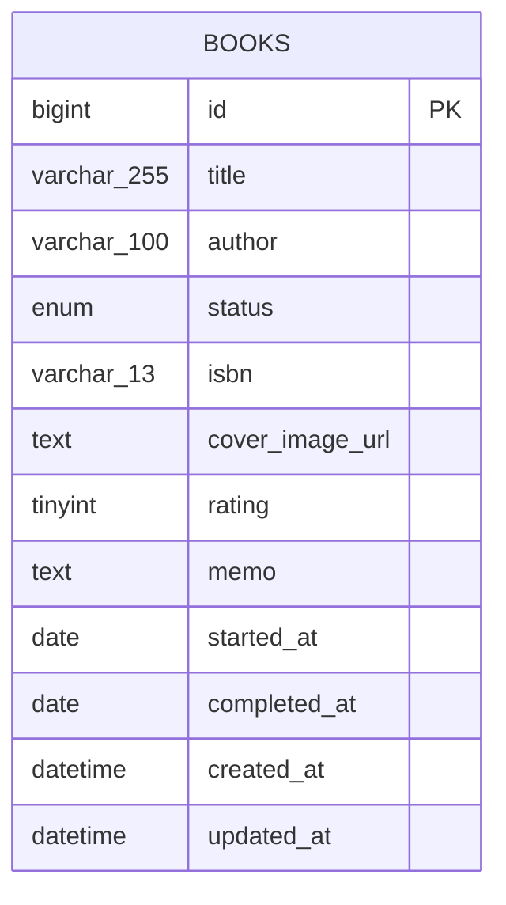
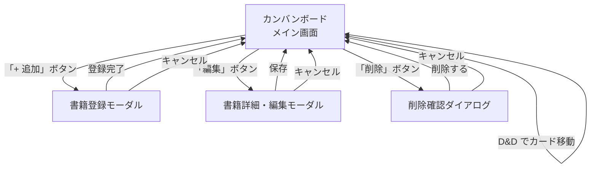
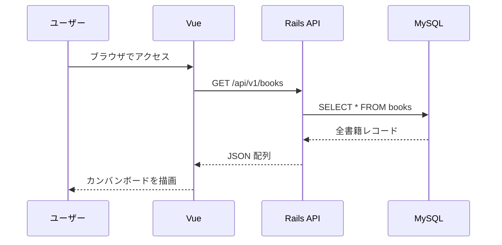
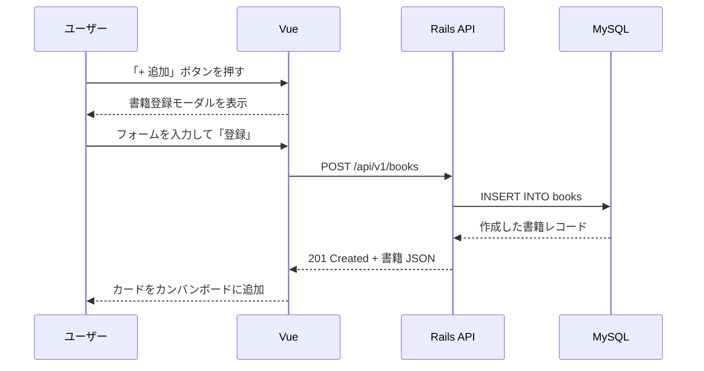
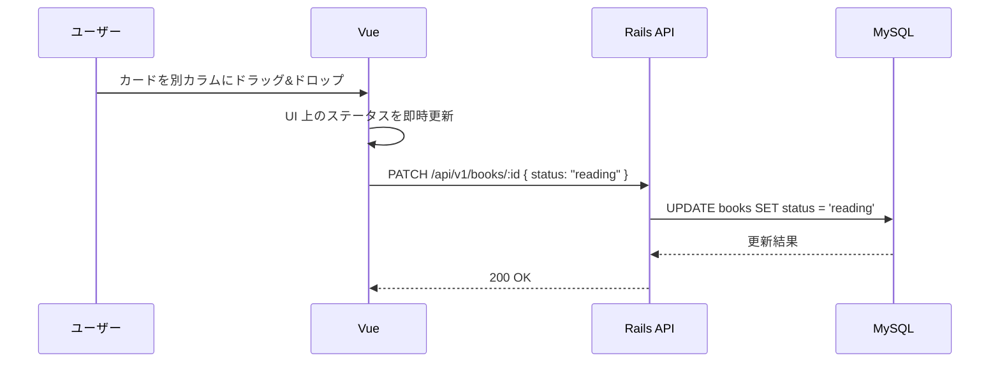
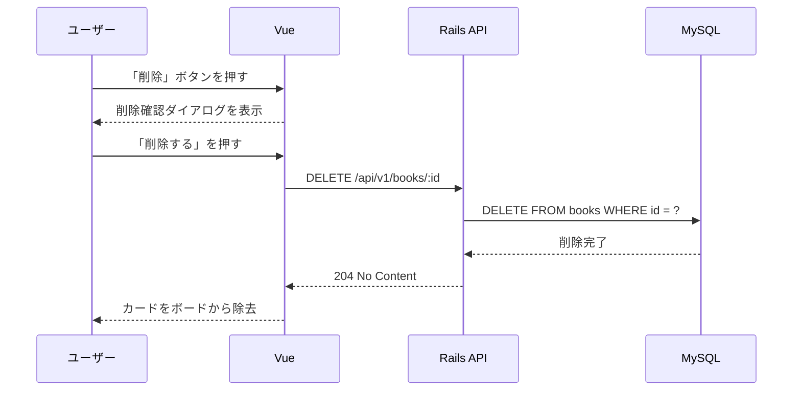
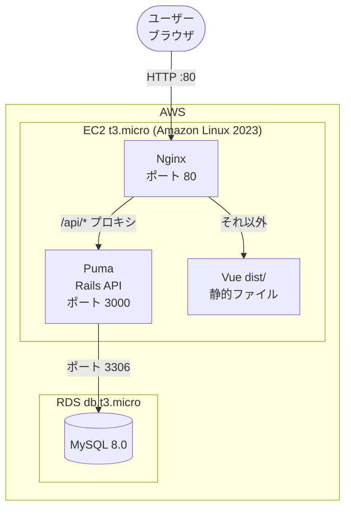

# 詳細設計

## 技術スタック

| レイヤー | 技術 | バージョン |
|---|---|---|
| フロントエンド | Vue 3 + TypeScript (Vite) | Vue 3.x / Vite 5.x |
| バックエンド | Ruby on Rails (API mode) | Rails 7.x / Ruby 3.3 |
| データベース | MySQL | 8.0 |
| インフラ（本番） | AWS EC2 + RDS | t3.micro / db.t3.micro |
| 開発環境 | Docker Compose | - |

---

## ER 図



> 現時点では books テーブル1つのみ。将来的にユーザー管理や複数テーブルを追加する場合はここにリレーションを追記する。

---

## テーブル定義

### books テーブル

| カラム | 型 | 制約 | 説明 |
|---|---|---|---|
| id | bigint | PK, AUTO_INCREMENT | 書籍 ID |
| title | varchar(255) | NOT NULL | タイトル |
| author | varchar(100) | NOT NULL | 著者名 |
| status | enum | NOT NULL, DEFAULT 'unread' | 読書ステータス |
| isbn | varchar(13) | NULLABLE | ISBN（13桁） |
| cover_image_url | text | NULLABLE | 表紙画像の外部 URL |
| rating | tinyint | NULLABLE | 評価（1〜5）|
| memo | text | NULLABLE | 感想メモ |
| started_at | date | NULLABLE | 読み始め日 |
| completed_at | date | NULLABLE | 読了日 |
| created_at | datetime | NOT NULL | 登録日時 |
| updated_at | datetime | NOT NULL | 更新日時 |

status の enum 値: `unread`（未読） / `reading`（読書中） / `completed`（読了）

---

## API 設計

Base URL: `/api/v1`

| Method | Path | 説明 | ステータスコード |
|---|---|---|---|
| GET | /books | 全書籍取得（`?status=unread` でフィルタ可） | 200 |
| POST | /books | 書籍新規登録 | 201 |
| GET | /books/:id | 書籍詳細取得 | 200 / 404 |
| PATCH | /books/:id | 書籍更新（ステータス変更含む） | 200 / 404 / 422 |
| DELETE | /books/:id | 書籍削除 | 204 / 404 |

### リクエスト・レスポンス例

**POST /books**

```json
// Request Body
{
  "title": "リーダブルコード",
  "author": "Dustin Boswell",
  "status": "unread",
  "isbn": "9784873115658"
}

// Response 201
{
  "id": 1,
  "title": "リーダブルコード",
  "author": "Dustin Boswell",
  "status": "unread",
  "isbn": "9784873115658",
  "cover_image_url": null,
  "rating": null,
  "memo": null,
  "started_at": null,
  "completed_at": null,
  "created_at": "2026-05-25T00:00:00.000Z"
}
```

**PATCH /books/:id（ステータス変更）**

```json
// Request Body
{ "status": "reading" }

// Response 200
{ "id": 1, "status": "reading", ... }
```

---

## 画面一覧

| 画面名 | 種別 | 説明 |
|---|---|---|
| カンバンボード | ページ（メイン） | 3カラムのボード。全書籍カードを表示し、D&D でステータスを変更する |
| 書籍登録モーダル | モーダル | 新規書籍を登録するフォーム |
| 書籍詳細・編集モーダル | モーダル | 既存書籍の詳細確認および全フィールドの編集フォーム |
| 削除確認ダイアログ | ダイアログ | 削除前の確認メッセージと「削除する」「キャンセル」ボタン |

---

## 画面遷移図



---

## データフロー

### 初期表示



### 書籍登録



### D&D によるステータス変更



### 書籍削除



---

## ディレクトリ構成

```
LibraryManagement/
├── frontend/                   # Vue 3 + TypeScript
│   ├── src/
│   │   ├── components/
│   │   │   ├── KanbanBoard.vue
│   │   │   ├── KanbanColumn.vue
│   │   │   ├── BookCard.vue
│   │   │   └── BookModal.vue
│   │   ├── api/
│   │   │   └── books.ts        # API 呼び出し関数
│   │   ├── types/
│   │   │   └── book.ts         # Book 型定義
│   │   └── App.vue
│   ├── Dockerfile
│   └── package.json
├── backend/                    # Ruby on Rails API
│   ├── app/
│   │   ├── controllers/api/v1/books_controller.rb
│   │   ├── models/book.rb
│   │   └── serializers/book_serializer.rb
│   ├── config/routes.rb
│   ├── db/migrate/
│   ├── Dockerfile
│   └── Gemfile
├── docs/
│   ├── requirements.md         # 要件定義
│   └── detailed-design.md      # 本ドキュメント
├── docker-compose.yml
├── CLAUDE.md
└── README.md
```

---

## デプロイ構成図



- EC2 セキュリティグループ: 80（HTTP）・22（SSH）を開放
- RDS セキュリティグループ: EC2 からの 3306 のみ許可
- 環境変数: EC2 の `.env` で DB 接続情報を管理（git 管理外）

---

## Docker 構成（開発環境）

```yaml
# docker-compose.yml（概要）
services:
  frontend:   # Vue 3 + Vite → localhost:5173
  backend:    # Rails API    → localhost:3000
  db:         # MySQL 8.0    → localhost:3306（db_data ボリュームで永続化）
```

- フロントエンドはローカルの Node.js（v24）で直接起動も可能
- Ruby / Rails はローカルインストール不要（Docker コンテナ内で動作）
- `docker compose down` でコンテナ停止、`-v` オプションで DB データも削除

---

## 実装フェーズ詳細

### Phase 1 — Vue 3 + TypeScript プロジェクト作成・カンバンボード UI

**目標:** モックデータでカンバンボードが動作するフロントエンドを構築する。

#### 実行コマンド

```bash
npm create vite@latest frontend -- --template vue-ts
cd frontend
npm install
npm install axios vue-draggable-plus
```

#### 作成・編集するファイル

| ファイル | 内容 |
|---|---|
| `src/types/book.ts` | Book 型定義（id, title, author, status など） |
| `src/components/KanbanBoard.vue` | 3カラムを横並びで表示するボード全体 |
| `src/components/KanbanColumn.vue` | 未読・読書中・読了 の各カラム |
| `src/components/BookCard.vue` | タイトル・著者を表示するカード |
| `src/App.vue` | KanbanBoard をマウントするルートコンポーネント |

#### モックデータ仕様

```ts
const books = ref<Book[]>([
  { id: 1, title: 'リーダブルコード', author: 'Dustin Boswell', status: 'unread' },
  { id: 2, title: 'Clean Architecture', author: 'Robert C. Martin', status: 'reading' },
])
```

#### 完了条件

- `npm run dev` で `http://localhost:5173` にアクセスし、3カラムが表示される
- モックデータの書籍が対応するカラムに表示される

---

### Phase 2 — ドラッグ&ドロップ・書籍登録モーダル・詳細編集 UI

**目標:** カードの移動・登録・編集・削除をモックデータ上で動作させる。

#### 作成・編集するファイル

| ファイル | 内容 |
|---|---|
| `src/components/KanbanColumn.vue` | vue-draggable-plus で D&D を実装 |
| `src/components/BookModal.vue` | 登録・編集フォーム（タイトル・著者・ISBN・評価・メモなど） |
| `src/components/BookCard.vue` | 編集・削除ボタンを追加 |

#### 完了条件

- カードを別カラムにドラッグ&ドロップするとステータスが変わる
- 「追加」ボタンでモーダルが開き、書籍を登録できる
- カードの編集・削除が動作する

---

### Phase 3 — Rails API プロジェクト作成・CRUD API 実装

**目標:** Docker 上で動く Rails API を構築し、books テーブルの CRUD を提供する。

#### 実行コマンド

```bash
docker run --rm -v "$(pwd)/backend:/app" -w /app ruby:3.3 \
  bash -c "gem install rails && rails new . --api --database=mysql --skip-git"
```

#### 作成・編集するファイル

| ファイル | 内容 |
|---|---|
| `config/routes.rb` | `namespace :api do namespace :v1 do resources :books end end` |
| `app/models/book.rb` | バリデーション（title・author 必須、status enum） |
| `db/migrate/xxx_create_books.rb` | books テーブル定義（テーブル定義参照） |
| `app/controllers/api/v1/books_controller.rb` | index / show / create / update / destroy |
| `config/initializers/cors.rb` | フロントエンド（localhost:5173）からの CORS を許可 |
| `Dockerfile` | `ruby:3.3-slim` ベース |

#### 完了条件

- `docker compose up backend db` で起動する
- `curl http://localhost:3000/api/v1/books` が `[]` を返す
- `curl -X POST` で書籍を登録・取得・更新・削除できる

---

### Phase 4 — フロントエンドを API に接続

**目標:** モックデータを削除し、Rails API からデータを取得・更新する。

#### 作成・編集するファイル

| ファイル | 内容 |
|---|---|
| `src/api/books.ts` | Axios を使った CRUD 関数（getBooks, createBook, updateBook, deleteBook） |
| `src/components/KanbanBoard.vue` | モックデータを削除し `getBooks()` で初期化 |
| `src/components/KanbanColumn.vue` | D&D 時に `updateBook()` でステータスを API に送信 |
| `src/components/BookModal.vue` | 登録・編集時に `createBook()` / `updateBook()` を呼ぶ |

#### 完了条件

- ブラウザでカードを移動すると DB のステータスが更新される
- ページリロード後もデータが保持されている

---

### Phase 5 — Docker Compose でローカル統合確認

**目標:** `docker compose up` の1コマンドで全サービスが起動する。

#### 作成するファイル

| ファイル | 内容 |
|---|---|
| `docker-compose.yml` | frontend / backend / db の3サービス定義 |
| `frontend/Dockerfile` | Node.js 24 ベース、Vite dev サーバー起動 |
| `backend/Dockerfile` | ruby:3.3-slim ベース、Puma 起動 |

#### 完了条件

- `docker compose up` で3サービスが起動する
- `http://localhost:5173` でカンバンボードが表示される
- カードの追加・移動・削除が DB に反映される

---

### Phase 6 — AWS EC2 + RDS デプロイ

**目標:** EC2 上で本番環境を構築し、パブリック IP でアクセスできる状態にする。

#### 手順概要

1. RDS (MySQL 8.0, db.t3.micro) をプライベートサブネットに作成
2. EC2 (Amazon Linux 2023, t3.micro) を作成し、セキュリティグループで 80・22 を開放
3. EC2 に Ruby 3.3・Nginx・Node.js をインストール
4. リポジトリをクローンし、`RAILS_ENV=production rails db:migrate` を実行
5. `npm run build` で Vue を静的ファイルにビルド
6. Nginx で `/api` を Puma にプロキシ、それ以外は `dist/` を配信

#### 完了条件

- EC2 のパブリック IP にブラウザでアクセスするとカンバンボードが表示される
- 書籍の追加・ステータス変更が RDS に保存される
